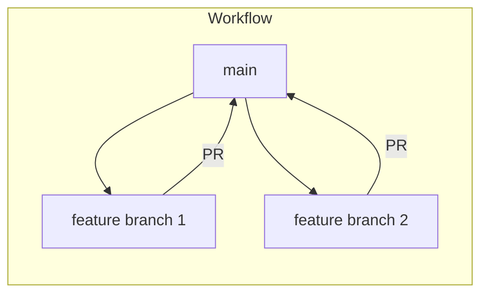

# Branching Strategy

**Read this first.** You'll learn why we use branches and the flow: main → feature branch → PR → main.  
**Next:** [Using GitHub Desktop](Branching%20strategy%20-%20Using%20Github%20Desktop.md)

---

In this doc you'll learn why we use branches, what **main** and **feature branches** are, and how your work gets into the shared codebase via a pull request (PR).

**Quick terms:** **branch** = a separate line of changes; **main** = the default stable branch; **feature branch** = a branch you create for one feature; **merge** = combine two branches; **pull request (PR)** = request to merge your branch into another; **conflict** = when two people changed the same lines and Git needs your help to decide the result.

---

## What is a branch?

When you start work on a GitHub repository, there is always a default branch called **main**. You can think of main as a timeline of your code's versions. Each commit adds a new point on this timeline, representing your code's state at that moment.

The **main** branch is the most important. It should contain stable, working code—the version the team agrees is ready. This is where the final work from all developers comes together.

(Image: timeline of the main branch with commits.)

## Why use different branches? "But I only commit to main!"

Committing directly to main as a team is risky. If several people push at once, you can introduce bugs or overwrite each other's work. You also lose a clear way to review changes before they go into the shared code.

The solution: **feature branches**. Each person (or pair) creates a **branch from main** for their task. You work on that branch, commit there, and when you're done you open a **pull request** to merge your work **into main**. That way main stays stable and everyone's work is reviewed before it lands.

## How do we use branches effectively?

You don't commit directly to **main**. Instead you create a **feature branch from main**, do your work there, then merge back into main (usually via a pull request). Here's an example.

### Example: Anna and John

Anna and John are building an app. Their team lead has created the repository. Here's the workflow:

1. Both clone the repository and switch to the **main** branch.
2. Anna will implement the Home page, John the Contacts page.
3. From **main**, each creates a feature branch: Anna creates `feature_homepage`, John creates `feature_contacts`.
4. They work on their own branches and commit there, without affecting main or each other.

(Image: main with two feature branches splitting off.)

## How do we combine our work?

When a feature is ready, you merge it into **main** using a **pull request**. A pull request is a request to merge your branch into main (with optional code review).

**Continuing with Anna and John:**

- Anna finishes first. She updates her feature branch with the latest **main** (in case main changed). Then she opens a **PR from her branch to main**. Someone reviews it and approves; her work is merged into main.
- When John finishes, he also updates his branch with the latest **main** (which now includes Anna's work). He opens a PR to main, gets review, and his work is merged into main.

(Image: pull requests from feature branches into main.)

## Quick summary

- **main** = the stable, shared branch. Don't commit directly to it.
- Create a **feature branch from main** for each task (e.g. `feature_homepage`).
- Work and commit on your feature branch.
- When done, open a **pull request** to merge your branch **into main**.
- After review and merge, main has your changes. For the next task, start again from main: create a new feature branch, work, then PR into main.

It's a simple cycle that keeps the codebase organized and makes it easy to work as a team.
