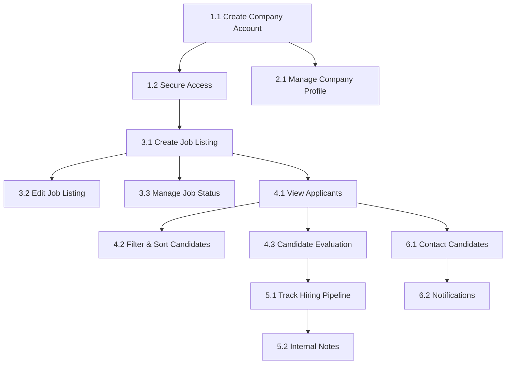
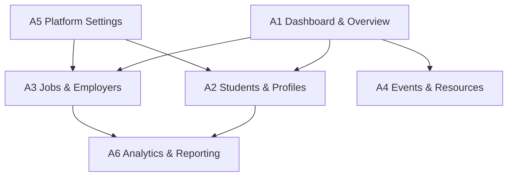
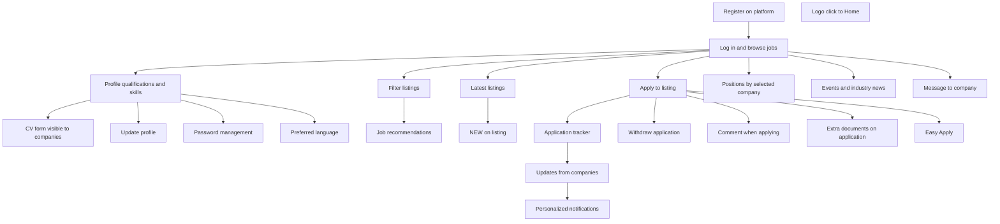

# User Story Prioritization by Epic — Iteration 1

## Prioritization Framework

Each story is assigned a priority tier:

- **P0 (Foundation)** — Must be done first; other stories depend on it
- **P1 (Core Value)** — Primary user value; can start once P0 is in progress
- **P2 (Enhancement)** — Enriches core flows; can be deferred if time is tight
- **P3 (Polish)** — Nice-to-have; cut first if capacity runs short

Within each tier, stories are ordered by dependency (top = start first). Stories at the same level within a tier can run **in parallel**.

---

## Epic 1: Company (Evergreen) — 43 team-days

### Dependency Graph

### Prioritized Order

**P0 — Foundation (5 days)**

| #   | Story                                     | Est. | Dependency | Notes                       |
| --- | ----------------------------------------- | ---- | ---------- | --------------------------- |
| 1   | `1.1 Create Company Account`              | 3d   | —          | Gate for everything         |
| 2   | `1.2 Secure Access (login/reset/session)` | 2d   | 1.1        | Enables authenticated flows |

**P1 — Core Value (6 days) — parallelize two tracks once P0 is done**

_Track A — Job Management:_

| #   | Story                    | Est. | Dependency | Notes                |
| --- | ------------------------ | ---- | ---------- | -------------------- |
| 3   | `3.1 Create Job Listing` | 1.5d | 1.2        | Core employer action |
| 4   | `3.2 Edit Job Listing`   | 1.5d | 3.1        | Parallel with 3.3    |
| 5   | `3.3 Manage Job Status`  | 1.5d | 3.1        | Parallel with 3.2    |

_Track B — Profile:_

| #   | Story                        | Est. | Dependency | Notes                 |
| --- | ---------------------------- | ---- | ---------- | --------------------- |
| 6   | `2.1 Manage Company Profile` | 2d   | 1.1        | Parallel with Track A |

**P2 — Enhancement (8.5 days) — start after P1 Track A**

_Track C — Candidate Pipeline:_

| #   | Story                          | Est. | Dependency | Notes                       |
| --- | ------------------------------ | ---- | ---------- | --------------------------- |
| 7   | `4.1 View Applicants`          | 1.5d | 3.1        | Unlocks candidate pipeline  |
| 8   | `4.2 Filter & Sort Candidates` | 1.5d | 4.1        | Parallel with 4.3           |
| 9   | `4.3 Candidate Evaluation`     | 1.5d | 4.1        | Parallel with 4.2           |
| 10  | `5.1 Track Hiring Pipeline`    | 2d   | 4.3        | Sequential after evaluation |
| 11  | `5.2 Internal Notes`           | 1.5d | 5.1        | Sequential after pipeline   |

**P3 — Polish (3.5 days)**

| #   | Story                    | Est. | Dependency | Notes                      |
| --- | ------------------------ | ---- | ---------- | -------------------------- |
| 12  | `6.1 Contact Candidates` | 2d   | 4.1        | Parallel with Track C tail |
| 13  | `6.2 Notifications`      | 1.5d | 6.1        | Parallel with 5.2          |

### Parallel Execution Summary

| Week Block | Track A (Job Mgmt) | Track B (Profile) | Track C (Pipeline)      | Track D (Comms) |
| ---------- | ------------------ | ----------------- | ----------------------- | --------------- |
| Weeks 1–2  | 1.1, 1.2 (P0)      | —                 | —                       | —               |
| Weeks 3–4  | 3.1, 3.2, 3.3      | 2.1               | —                       | —               |
| Weeks 5–7  | —                  | —                 | 4.1, 4.2, 4.3, 5.1, 5.2 | —               |
| Weeks 7–8  | —                  | —                 | —                       | 6.1, 6.2        |

---

## Epic 2: Admin (Meridian) — 75 team-days (over capacity)

Since this epic exceeds the 60-day budget, the prioritization also serves as the **scope-cut guide**. Sub-groups A1 through A4 (46.5 days) fit within budget. A5 and A6 are candidates for deferral or partial inclusion.

### Dependency Graph (high-level by sub-group)

### Prioritized Order

**P0 — Foundation (10 days)**

These establish the admin shell and the two most critical management areas. A1 is the entry point; A5-01 and A5-02 unlock role-gated features across all other sub-groups.

| #   | Story                                     | Est. | Dependency | Notes                                 |
| --- | ----------------------------------------- | ---- | ---------- | ------------------------------------- |
| 1   | `A1-01 Admin home dashboard`              | 1.5d | —          | Admin entry point                     |
| 2   | `A1-05 Quick navigation shortcuts`        | 1d   | —          | Parallel with A1-01                   |
| 3   | `A5-01 Manage admin accounts`             | 1.5d | —          | Parallel with A1; enables permissions |
| 4   | `A5-02 Role and permission configuration` | 2d   | A5-01      | Unlocks role-gated features           |
| 5   | `A1-02 Platform KPI metrics`              | 1.5d | A1-01      | Parallel with A1-04                   |
| 6   | `A1-04 Pending actions queue`             | 1.5d | A1-01      | Parallel with A1-02                   |

**P1 — Core Value (25 days) — three parallel tracks**

_Track A — Student Management:_

| #   | Story                                             | Est. | Dependency | Notes                 |
| --- | ------------------------------------------------- | ---- | ---------- | --------------------- |
| 7   | `A2-01 Student directory with search and filters` | 1.5d | A1 done    | Start of student mgmt |
| 8   | `A2-02 View full student profile`                 | 1.5d | A2-01      | Sequential            |
| 9   | `A2-03 Approve or reject student profile`         | 1.5d | A2-02      | Parallel with A2-04   |
| 10  | `A2-04 Edit a student record`                     | 1.5d | A2-02      | Parallel with A2-03   |
| 11  | `A2-05 Suspend or deactivate student account`     | 1d   | A2-01      | Parallel with A2-02   |

_Track B — Jobs & Employers:_

| #   | Story                                              | Est. | Dependency | Notes                 |
| --- | -------------------------------------------------- | ---- | ---------- | --------------------- |
| 12  | `A3-01 Employer directory with search and filters` | 1.5d | A1 done    | Parallel with Track A |
| 13  | `A3-02 Approve or reject new employer account`     | 1.5d | A3-01      | Sequential            |
| 14  | `A3-03 Manage all job listings`                    | 2d   | A3-01      | Parallel with A3-02   |
| 15  | `A3-04 Approve or reject job posting`              | 1.5d | A3-03      | Sequential            |
| 16  | `A3-06 Suspend an employer account`                | 1d   | A3-01      | Parallel with A3-03   |

_Track C — Events & Resources (first half):_

| #   | Story                                 | Est. | Dependency | Notes                      |
| --- | ------------------------------------- | ---- | ---------- | -------------------------- |
| 17  | `A4-01 Create a new event`            | 1.5d | A1 done    | Parallel with Tracks A & B |
| 18  | `A4-02 Edit or cancel existing event` | 1.5d | A4-01      | Sequential                 |
| 19  | `A4-06 Create a new resource`         | 1.5d | —          | Parallel with A4-01        |
| 20  | `A4-07 Edit or archive a resource`    | 1.5d | A4-06      | Sequential                 |

**P2 — Enhancement (18.5 days) — fit what capacity allows**

| #   | Story                                              | Est. | Dependency  | Notes                                      |
| --- | -------------------------------------------------- | ---- | ----------- | ------------------------------------------ |
| 21  | `A1-03 Recent activity feed`                       | 1.5d | A1-01       | Parallel with A1-06                        |
| 22  | `A1-06 Alerts and system notices`                  | 1.5d | A1-01       | Parallel with A1-03                        |
| 23  | `A2-06 Bulk import students via CSV`               | 2d   | A2-01       | Independent                                |
| 24  | `A2-07 Assign or change student academy programme` | 1.5d | A2-04       | Sequential                                 |
| 25  | `A3-05 Feature a company on student dashboard`     | 1d   | A3-01       | Independent                                |
| 26  | `A3-07 View application analytics per job listing` | 1.5d | A3-03       | Sequential                                 |
| 27  | `A3-08 Review and manage profile access requests`  | 1.5d | A3-01       | Independent                                |
| 28  | `A4-03 View event registrations`                   | 1.5d | A4-01       | Sequential                                 |
| 29  | `A4-05 Send notification to event registrants`     | 1.5d | A4-03       | Sequential                                 |
| 30  | `A4-08 Assign resource to academy programme`       | 1.5d | A4-06       | Sequential                                 |
| 31  | `A6-01 Platform overview analytics`                | 2d   | A2, A3 done | Needs data from student & employer modules |

**P3 — Polish / Defer to Iteration 2 (21.5 days)**

| #   | Story                                                | Est. | Dependency | Notes               |
| --- | ---------------------------------------------------- | ---- | ---------- | ------------------- |
| 32  | `A2-08 Export student data`                          | 1.5d | A2-01      |                     |
| 33  | `A2-09 View profile privacy access log`              | 1.5d | A2-02      |                     |
| 34  | `A4-04 Export event attendee list`                   | 1d   | A4-03      |                     |
| 35  | `A4-09 View resource usage analytics`                | 1.5d | A4-06      |                     |
| 36  | `A5-03 Manage in-app notification templates`         | 1.5d | A5-02      |                     |
| 37  | `A5-04 Manage email templates`                       | 1.5d | A5-02      |                     |
| 38  | `A5-05 Configure privacy policy settings`            | 1.5d | A5-02      |                     |
| 39  | `A5-06 Configure language and localisation settings` | 1.5d | A5-02      |                     |
| 40  | `A5-07 View platform audit log`                      | 2d   | A5-01      |                     |
| 41  | `A5-08 Data export and compliance tools`             | 2d   | A5-02      |                     |
| 42  | `A6-02 Student engagement metrics`                   | 2d   | A6-01      |                     |
| 43  | `A6-03 Job and application funnel analytics`         | 2d   | A6-01      |                     |
| 44  | `A6-04 Employer performance metrics`                 | 1.5d | A6-01      |                     |
| 45  | `A6-05 Event attendance analytics`                   | 1.5d | A6-01      |                     |
| 46  | `A6-06 Recommendation algorithm performance`         | 1.5d | A6-01      |                     |
| 47  | `A6-07 Custom report builder and scheduled exports`  | 4.5d | A6-01      | Largest single item |

### Scope Recommendation for Iteration 1

- **Include**: P0 + P1 + partial P2 = ~53.5 days (fits within 60-day budget with buffer)
- **Defer**: All of P3 (21.5 days) to Iteration 2
- **Buffer**: Remaining ~6.5 days absorbs overruns and allows cherry-picking P2 items

---

## Epic 3: Students (Bloom) — 36 team-days

### Dependency Graph

### Prioritized Order

**P0 — Foundation (2.5 days)**

| #   | Story                    | Est. | Dependency | Notes                           |
| --- | ------------------------ | ---- | ---------- | ------------------------------- |
| 1   | `Register on platform`   | 1.5d | —          | Gate for everything             |
| 2   | `Log in and browse jobs` | 1d   | Register   | Enables all authenticated flows |

**P1 — Core Value (9.5 days) — two parallel tracks**

_Track A — Profile & CV:_

| #   | Story                               | Est. | Dependency | Notes                 |
| --- | ----------------------------------- | ---- | ---------- | --------------------- |
| 3   | `Profile qualifications and skills` | 1.5d | Login      | Core student identity |
| 4   | `Update profile`                    | 1d   | Profile    | Parallel with CV      |
| 5   | `CV form visible to companies`      | 1.5d | Profile    | Parallel with Update  |

_Track B — Job Discovery & Application:_

| #   | Story              | Est. | Dependency | Notes                 |
| --- | ------------------ | ---- | ---------- | --------------------- |
| 6   | `Filter listings`  | 1.5d | Login      | Parallel with Track A |
| 7   | `Latest listings`  | 1d   | Login      | Parallel with Filter  |
| 8   | `NEW on listing`   | 1d   | Latest     | Parallel with Filter  |
| 9   | `Apply to listing` | 1.5d | Login      | Core student action   |

**P2 — Enhancement (14 days)**

_Track C — Application Management:_

| #   | Story                            | Est. | Dependency | Notes                    |
| --- | -------------------------------- | ---- | ---------- | ------------------------ |
| 10  | `Application tracker`            | 1.5d | Apply      | Post-application flow    |
| 11  | `Withdraw application`           | 1.5d | Apply      | Parallel with Tracker    |
| 12  | `Comment when applying`          | 1d   | Apply      | Parallel with Tracker    |
| 13  | `Extra documents on application` | 1.5d | Apply      | Sequential after basics  |
| 14  | `Easy Apply`                     | 1d   | Apply      | Parallel with Extra docs |

_Track D — Company & Content:_

| #   | Story                                   | Est. | Dependency | Notes                         |
| --- | --------------------------------------- | ---- | ---------- | ----------------------------- |
| 15  | `Positions by selected company`         | 1d   | Login      | Parallel with Track C         |
| 16  | `Events and industry news`              | 1.5d | Login      | Parallel with Track C         |
| 17  | `Logo click to Home`                    | 1d   | —          | Independent; parallel anytime |
| 18  | `Updates from companies (applications)` | 2d   | Tracker    | Sequential                    |
| 19  | `Password management`                   | 1.5d | Profile    | Parallel anytime              |

**P3 — Polish (10 days)**

| #   | Story                        | Est. | Dependency             | Notes                |
| --- | ---------------------------- | ---- | ---------------------- | -------------------- |
| 20  | `Personalized notifications` | 2d   | Updates from companies | Sequential           |
| 21  | `Job recommendations`        | 3d   | Filter                 | Largest single story |
| 22  | `Preferred language`         | 2d   | Profile                | Independent          |
| 23  | `Message to company`         | 1.5d | Login                  | Independent          |

### Capacity Note

At 36 team-days against a 60-day budget, this team has **24 days of slack**. Options:

1. Absorb overruns from the other epics (cross-team support)
2. Invest in UI polish across all Bloom pages
3. Pick up deferred Admin P3 stories (exports, analytics views)
4. Start cross-module integration work early

---

## Already Completed Features (from Boilerplate)

The following capabilities are delivered and functional (with mock data) as of the Phase 1 boilerplate. Described from a business perspective with minimal technical wording.

### Platform-Wide

| Feature               | Description                                                                                                |
| --------------------- | ---------------------------------------------------------------------------------------------------------- |
| User login by role    | Users can sign in as Student, Alumni, Employer, or Admin and see role-appropriate content                  |
| Role-based access     | Each user type can only reach pages and actions permitted for their role                                   |
| Page-level navigation | All pages are bookmarkable, support browser back/forward, and show a 404 page for invalid URLs             |
| Responsive layout     | Every screen adapts to mobile, tablet, and desktop viewports                                               |
| Visual design system  | Consistent branding (purple gradient), typography, badges, card styles, and iconography across all modules |

### Student / Alumni Features

| Feature                   | Description                                                                                                                                                |
| ------------------------- | ---------------------------------------------------------------------------------------------------------------------------------------------------------- |
| Job board with filtering  | Browse all open positions; filter by employment type, work mode, experience level, and company; sort by date, salary, or popularity                        |
| Job detail and apply      | View full job information with company sidebar; submit an application with cover letter and CV; prevents duplicate applications                            |
| NEW and FEATURED badges   | Recently posted jobs show a "NEW" badge; priority listings show a "FEATURED" badge                                                                         |
| Company directory         | Browse and search companies by name, industry, or description; see company size, locations, and number of open positions                                   |
| Profile and CV management | Edit personal info, work experience, education, academy attendance, skills, and language proficiency; toggle profile visibility between public and private |

### Employer Features

| Feature                    | Description                                                                                                                                                            |
| -------------------------- | ---------------------------------------------------------------------------------------------------------------------------------------------------------------------- |
| Job posting form           | Create a new job listing with title, type, work mode, location, experience level, description, required/nice-to-have skills, salary range, deadline, and featured flag |
| Subscription-aware limits  | The system checks the employer's subscription tier and shows an upgrade prompt when the posting limit is reached                                                       |
| Candidate search           | Browse student and alumni profiles; filter by keyword, user type, skills, and visibility; sort by name, recency, or role                                               |
| Privacy-respecting display | Candidate contact details are shown or hidden based on each candidate's privacy settings                                                                               |

### Admin Features

| Feature             | Description                                                                                                                                                   |
| ------------------- | ------------------------------------------------------------------------------------------------------------------------------------------------------------- |
| User management     | View all users in a table with role badges and visibility status; search and filter; view, edit, or delete users (admin accounts are protected from deletion) |
| Analytics dashboard | View platform KPIs (total users, active jobs, applications, hires), monthly growth, top in-demand skills, top hiring companies, and platform health metrics   |

### Data Foundation

| Feature              | Description                                                                                                                          |
| -------------------- | ------------------------------------------------------------------------------------------------------------------------------------ |
| Data models          | 12 structured models covering Users, CV Profiles, Jobs, Companies, Applications, Events, Success Stories, and Analytics              |
| Mock data operations | 20+ create/read/update/delete operations with simulated loading delays for realistic UI behaviour                                    |
| Seeded test data     | 4 test accounts (one per role), 6 sample job listings across 4 companies, sample applications, CV profile, success story, and events |
